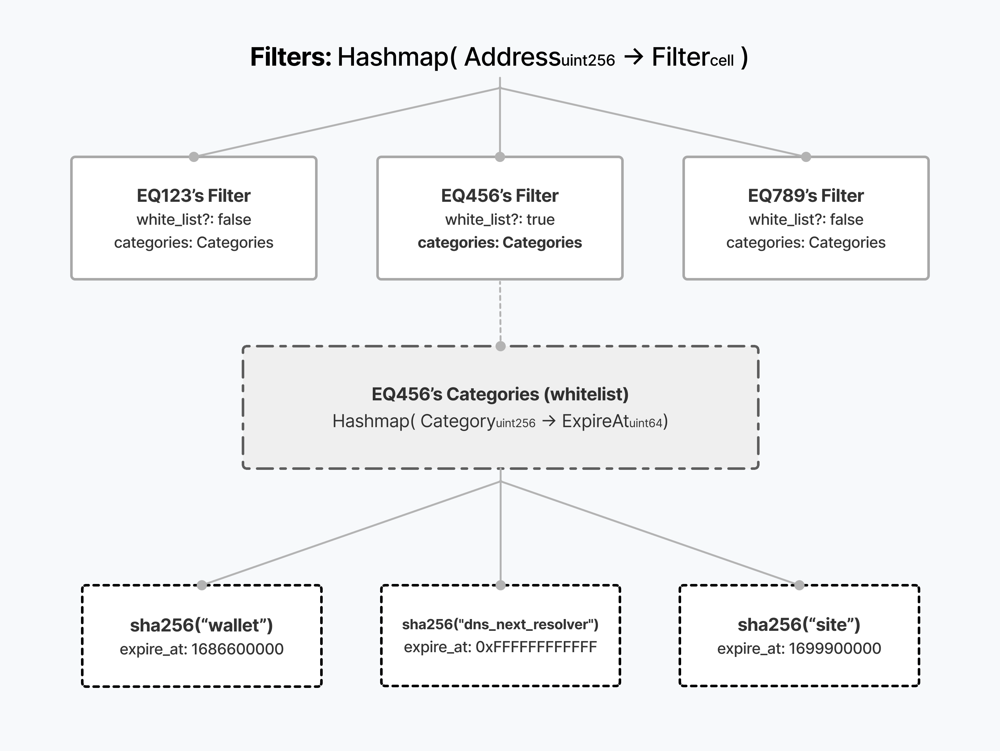

- **TEP**: [0](https://github.com/ton-blockchain/TEPs/pull/0)
- **title**: DNS Stratum Contract
- **status**: Draft
- **type**: Contract Interface
- **authors**: [Victor Syshchenko](https://github.com/1ixi1)
- **created**: 21.03.2023
- **replaces**: -
- **replaced by**: -


# Summary

DNS Stratum Contract is a layer between users and a domain, allowing users
to manage records in the domain by sending messages with the body of the
corresponding format not directly to the domain, but to the layer that
filters the editing of certain records and forwards messages to the
domain.


# Motivation

The potential use of records in TON DNS is very significant. They can be
used not only to link a wallet or address in TON Storage, but also to
establish personal data, contacts, and almost anything else, if desired.

Sometimes, a certain service needs a guarantee that a particular record in
the domain will remain unchanged for a certain period of time, or even
permanently.

To prevent developers from coming up with various new contracts for these
purposes, a standard needs to be created that will primarily serve as
a model for discovering contracts of this type.


# Guide / Useful links

1. [Reference DNS Stratum smart contract](https://github.com/1IxI1/stratum-contract/)
2. [Reference TON DNS smart contracts](https://github.com/ton-blockchain/dns-contract)


# Specification

### Internal messages
When receiving an internal message with any specified op to change
the DNS item's record, a smart contract that implements the DNS Stratum
standart **should**:
   * Reject it if the sender does not have editorship for this category
   or the expiration time passed.
   * Otherwise should resend it to the DNS Item.

### Get-methods
A smart contract **must** contain:
1. `editorship_expires_at(slice editor_address, int category)`
   returns `int`:
   * `0` if address has no editorship on this category.
   * and timestamp of editorship/stratum expiration time otherwise.

2. `get_dns_item_address()` returns `slice dns_item_address` -
   address of the dns item to which stratum filters messages.

3. `get_expiration_data()` returns `(int expiration_time, slice return_address)`
   `expiration_time` - timestamp of the time after which the contract
   may self-destruct after any run and transfer the dns item to
   the address `return_address`.


# Drawbacks

None for now


# Prior art
None


# Rationale and alternatives

Creating such a contract is a matter of time. DNS Items can be used as
a fast data storage on the blockchain with binding to a specific wallet or
even to several wallets. This design could take into account the limit of
changes to certain records, the transfer of editorship, the addition of
new editors with the consent of existing ones, and so on. The standard
describes the simplest and the softest interface for defining such layers and for
obtaining the main information from them. Additions can be implemented in
the following TEPs.


# Unresolved questions

### Should the filters architecture be present in the standart?
If we add the following section to the [Specification](#specification), developers will have
fewer opportunities to create contracts with advanced functionality according to
this standard. However, this will make it much easier for scanners and
wallets to display all the information about which user can change which
record. \
For example, when implementing the possibility of transferring
editorship, it will be impossible to solve the problem of merging
whitelist and blacklist with the same categories and different expiration
times. If Alice has **no ability to edit 111 record until 200, but has
ability to edit any other records** and Bob transfers to Alice his **ability to
edit 111 until 100, but nothing more**, it is impossible to solve
corresponding to the following scheme, where every address have it's own filter.

#### Filters architecture
Filters must implement a hashmap of the following TL-B scheme:
```
_ (HashmapE 256 uint64) = Categories;

filter#89e1 white_list: Bool categories: Categories = Filter;

_ (HashmapE 256 Filter) = Filters;
```

Where every address hashpart (256 bits) points on an individual filter. \
And every individial filter consists of whitelist boolean marker
and categories hashmap. In the categories hashmap every 256-bit key
points on time of the editorship (or block) expiration.




# Future possibilities
- To create an operator who will manage the rights to edit the domain.
- To create a domain rent contract based on this standart.
- To implement the possibility of transferring editorship.
- To create a contract for selling the ability to change some records
  on some domain.
- To create a contract where the domain owner could sell/transfer editorship
  on some records to services such as game.fi, where they could store user
  progress for his money in a decentralized way.
