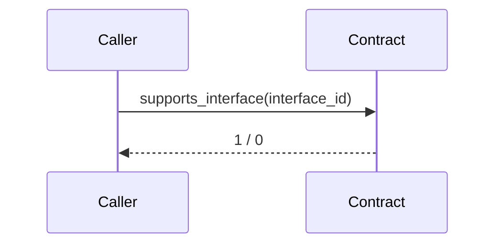

- **TEP**: [0178](https://github.com/ton-blockchain/TEPs/pull/0178)
- **title**: *TON Standard Interface Detection*
- **status**: Draft
- **type**: Core 
- **authors**: [Dr. Awesome Doge](https://github.com/hacker-volodya), [Pei](p@tonx.tg), [CC, Wang](https://github.com/a2468834), [Wei Yi](https://github.com/WeiYiChiuAtTonfura)
- **created**: 30.07.2024

# Summary
This TEP proposes the introduction of a Standard Interface Detection mechanism for the TON blockchain, inspired by Ethereum's EIP-165. The proposed standard aims to standardize the methods for detecting and confirming the implementation of interfaces in smart contracts on the TON blockchain using FIFT, FUNC, and TACT languages. This will enhance interoperability and simplify the integration of various smart contracts within the TON ecosystem.

# Motivation
In the TON blockchain ecosystem, there is a need for a standardized approach to detect and confirm the implementation of interfaces by smart contracts. This standardization will:
- Simplify the process of interface detection for developers.
- Improve interoperability between different TON-based smart contracts.
- Provide a clear and consistent method for confirming interface implementations.

# Specification

## 1. Interface Identifier

For this TEP, an *interface* is composed of a set of get-methods. Every interface will have a unique 64-bit integer identifier (ID) that represents itself. The ID will be calculated by the XOR of all get-methods' `method-id` in that interface.

## 2. Interface Detection
Smart contracts that are compliant with this TEP should implement the following get-method:

```func
int supports_interface(int interface_id) method_id;
```

- `interface_id`: The 64-bit integer of the specific interface ID
- `supports_interface` will return `1` along with TVM `ExitCode=0` only if the contract implements the certain `interface_id`.

## 3. Implementation Requirements
- Smart contracts must implement the `supports_interface` get-method to support interface detection.
- The `supports_interface` method must use a reasonable amount of gas to ensure efficiency.

## 4. Example Implementations

### Example in FUNC
```func
;; Constant
int SUPPORTS_INTERFACE_ID() asm "82022 PUSHINT"; ;; 0x14066
int NFT_COLLECTION_INTERFACE_ID() asm "45682 PUSHINT"; ;; 0xB272

;; Get method

(int, cell, slice) get_collection_data() method_id;
slice get_nft_address_by_index(int index) method_id;
(int, int, slice) royalty_params() method_id;
cell get_nft_content(int index, cell individual_nft_content) method_id;

int supports_interface(int interface_id) method_id {
  if ((interface_id == SUPPORTS_INTERFACE_ID()) | (interface_id == NFT_COLLECTION_INTERFACE_ID())) {
    return 1;
  }
  else {
    return 0;
  }
}
```



# Rationale
The rationale behind this proposal is to provide a robust and standardized way to handle interface detection within the TON ecosystem. By adopting and adapting the proven methods from Ethereum (EIP-165), we can ensure a high level of interoperability and simplicity for smart contract developers.

# Implementation
The implementation will involve:
- Developing libraries and tools to support the new standard.
- Updating relevant documentation and guides for developers.
- Conducting security audits and tests to ensure the robustness of the implementation.

# Backward Compatibility
For the contracts that deployed before this TEP, we could get TVM `ExitCode=11` along with the arbitrary stack return values. Only when calling `supports_interface` and getting `1` without any TVM exit error is viewed as the successful case indecates the contract supports the certain interface. Therefore, this TEP shall be fully backward compatible.

# Test Cases
Include detailed test cases to validate the `supports_interface` method for various smart contracts and interfaces.

# Security Considerations
Discuss potential security risks and mitigation strategies, including:
- Ensuring the accuracy of the `supports_interface` method.
- Protecting against gas limit attacks.
- Verifying the authenticity of the interface IDs.

---

By adopting this TEP, the TON blockchain will benefit from enhanced interoperability and simplified interface detection processes, facilitating more sophisticated and integrated smart contract interactions.
