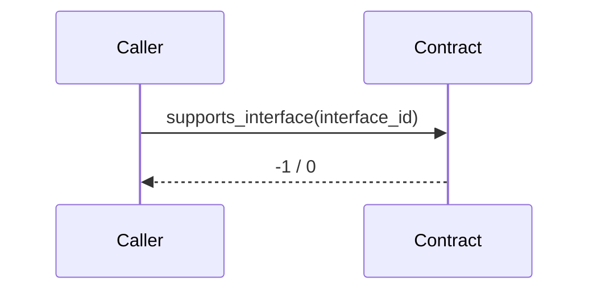

- **TEP**: [0180](https://github.com/ton-blockchain/TEPs/pull/0180)
- **title**: *TON Standard Interface Detection*
- **status**: Draft
- **type**: Contract Interface
- **authors**: [Dr. Awesome Doge](https://github.com/hacker-volodya), [Pei](p@tonx.tg), [CC, Wang](https://github.com/a2468834), [Wei Yi](https://github.com/WeiYiChiuAtTonfura)
- **created**: 30.07.2024

# Summary
This TEP proposes introducing a Standard Interface Detection mechanism for the TON blockchain, inspired by Ethereum's EIP-165. The proposed standard aims to standardize the methods for detecting and confirming the implementation of interfaces in smart contracts on the TON blockchain using FunC, Fift, and Tact languages. This will enhance interoperability and simplify the integration of various smart contracts within the TON ecosystem.

# Motivation
In the TON blockchain ecosystem, there is a need for a standardized approach to detect and confirm the implementation of interfaces by smart contracts. This TEP will:
- Simplify the process of interface detection for developers.
- Improve interoperability between different TON-based smart contracts.
- Provide a clear and consistent method for confirming interface implementations.

# Specification

> The key words “MUST”, “MUST NOT”, “REQUIRED”, “SHALL”, “SHALL NOT”, “SHOULD”, “SHOULD NOT”, “RECOMMENDED”, “NOT RECOMMENDED”, “MAY”, and “OPTIONAL” in this document are to be interpreted as described in [RFC 2119](https://www.ietf.org/rfc/rfc2119.html) and [RFC 8174](https://www.ietf.org/rfc/rfc8174.html).

## Interface Identifier

For this TEP, an *interface* is composed of a set of get-methods. Every interface has a unique 64-bit integer identifier (ID) that represents itself. This ID SHALL be calculated by doing XOR of all get-methods' `method-id` in that interface. The detailed procedure of `method-id` can be found at [here](https://github.com/ton-blockchain/ton/blob/db505f45b2f3a4f6469e0cbb55a3fc3ffcef59c5/lite-client/lite-client.cpp#L1228-L1234).

## Interface Detection
Smart contracts that are compliant with this TEP SHOULD implement the following get-method:

```func
int supports_interface(int interface_id) method_id;
```

- `interface_id` is the integer indicates the specific interface ID.
- `supports_interface` MUST return `TRUE` (e.g., an integer `-1` in FunC) along with TVM `ExitCode=0` only if the smart contract implements the certain `interface_id`.

If the smart contract supports multiple interfaces (e.g., making a wallet v4r2 that is also a NFT collection), it is REQUIRED to return `TRUE` with respect to all the supported `interface_id`s. This can be done by store a dictionary variable in the contract storage.

## Implementation Requirements
- Smart contracts MUST implement the `supports_interface` get-method to support interface detection.
- The `supports_interface` method SHOULD use a reasonable amount of gas to ensure efficiency.

## Example Implementation

Here is an example NFT collection in FunC language that supports this TEP. For the sake of simplicity, we have omitted part of codes that is not related to this TEP (e.g., `recv_internal()`).

```func
;; Constant

int SUPPORTS_INTERFACE_ID() asm "82022 PUSHINT"; ;; 0x14066
int NFT_COLLECTION_INTERFACE_ID() asm "45682 PUSHINT"; ;; 0xB272

;; Get method

(int, cell, slice) get_collection_data() method_id {}
slice get_nft_address_by_index(int index) method_id {}
(int, int, slice) royalty_params() method_id {}
cell get_nft_content(int index, cell individual_nft_content) method_id {}

int supports_interface(int interface_id) method_id {
  if (interface_id == SUPPORTS_INTERFACE_ID()) {
    return -1;
  }

  if (interface_id == NFT_COLLECTION_INTERFACE_ID()) {
    return -1;
  }

  return 0;
}
```

According to the content mentioned above, here is the list of `method_id`s.
- `get_collection_data`=`0x1905B`
- `get_nft_address_by_index`=`0x167A3`
- `royalty_params`=`0x14ED7`
- `get_nft_content`=`0x10B5D`

Next, do the bitwise XOR procedure on all of them. Therefore, the desired `NFT_COLLECTION_INTERFACE_ID` constant value will be `0xB272`.




# Rationale
The rationale behind this proposal is to provide a robust and standardized way to handle interface detection within the TON ecosystem. By adopting and adapting the proven methods from Ethereum (EIP-165), we can ensure a high level of interoperability and simplicity for smart contract developers.

# Implementation
The implementation will involve:
- Developing libraries and tools to support the new standard.
- Updating relevant documentation and guides for developers.
- Conducting security audits and tests to ensure the robustness of the implementation.

# Backward Compatibility
For the contracts deployed before this TEP, we could get TVM `ExitCode=11` along with the arbitrary stack return values. Only when calling `supports_interface` and getting `TRUE` without any TVM exit error is viewed as the successful case indicates the contract supports the specific interface. Therefore, this TEP shall be fully backward compatible.

# Security Considerations
Discuss potential security risks and mitigation strategies, including:
- Ensuring the accuracy of the `supports_interface` method.
- Protecting against gas limit attacks.
- Verifying the authenticity of the interface IDs.

---

By adopting this TEP, the TON blockchain will benefit from enhanced interoperability and simplified interface detection processes, facilitating more sophisticated and integrated smart contract interactions.
