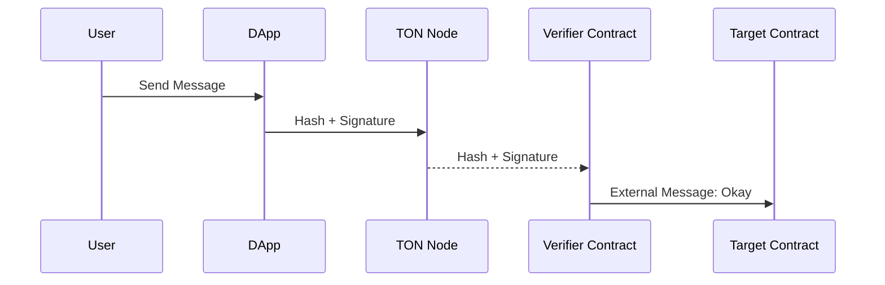

- **TEP**: [0181](https://github.com/ton-blockchain/TEPs/pull/0181)
- **title**: *TON Signing Typed Data Standard*
- **status**: Draft
- **type**: Core 
- **authors**: [Dr. Awesome Doge](https://github.com/hacker-volodya), [Pei](p@tonx.tg), [CC, Wang](https://github.com/a2468834), [Wei Yi](https://github.com/WeiYiChiuAtTonfura)
- **created**: 30.07.2024

# Summary
This TEP proposes the introduction of a standard of signing typed data for the TON blockchain, inspired by Ethereum's EIP-191 and EIP-712. The proposed standard aims to standardize the methods for signing and verifying typed structured data on the TON blockchain. This will enhance security and interoperability for TON-based applications, particularly in scenarios involving off-chain data integrity and authentication.

# Motivation
In the TON blockchain ecosystem, there is a need for a standardized approach to sign and verify typed structured data. This standardization will:
- Enhance the security of off-chain and on-chain data interactions.
- Improve interoperability between different TON-based applications.
- Provide a clear and consistent method for developers to implement data signing and verification processes.

# Specification

## 1. Signing Typed Data Standard

This section outlines the TON version of the signing typed data standard. 

### 1.1 Format

The signable `message` is denoted as the structured data `𝕊`. Encoding along the `domainSeparator`, the format for the data to be signed should follow the structure:

`encode(domainSeparator : 𝔹²⁵⁶, message : 𝕊) = prefix || domainSeparator || hashStruct(message)`

`||` means bitwise concatenation and the definition of `prefix`, `domainSeparator`, and `hashStruct(message)` are described below.

### 1.2 Definition of `prefix`

The first part of the encoded signed data is 2-byte `prefix`.

`prefix = 0xFF || flag`

The 1-byte `flag` is in the range `[0x00, 0xFF]`. Besides, `0xFF` represents for choosing SHA256 hash function along with the following encoding procedure. The rest of `[0x00, 0xFE]` is reserved for the future use. Note that the category of hash funcition using in the whole signing procedure should be kept consistent.

### 1.3 Definition of structured data 𝕊

Before getting startd to define the core functionality of encoding, we need to clarify which data type of `message` can be encoded. To reach the maximum composibility of TON Virtual Machine (TVM), the acceptable encoding types should be specific to the TVM. However, it aims to be agnostic to higher level languages such as FunC and can be added new types in the future.

- The `atomic` types are nativly supported by TVM and other higher level languages, such as `int`, `cell`, and `slice`.
    - Floating point numbers are not supported by this proposal, but may be supported by the future TEP.
    - To make less ambiguous representation, the name of integer and unsigned integer types needs to specify the length of bits. For example, `int8` and `uint32` are acceptable, but using `int` type name is not allowed.
- The `composite` type is composed of several `atomic` types whose type definition should be written in a fixed order represents for the encoding and decoding sequence. For example, `foo {int2 a; uint4 b; cell c;}` means the `composite` type `foo` consists of three `atomic` types  respectively two integers `a`, `b` and a cell `c`.


### 1.4 Definition of `encodeType()`

When the message `s` is made up of a single `atomic` type, taking `typeOf` operation of it is simple: `typeOf(s) = type ‖ " " ‖ name`, e.g., `typeOf(int8 a) = int8 a`.

When the message `s` is `composite` type, we should apply the `encodeType()` definition recursively: `name ‖ "(" ‖ member₁ ‖ "," ‖ member₂ ‖ "," ‖ … ‖ memberₙ ")"` where every `member` is either a `composite` type or a `atomic` type. If `member` is `atomic` type, we apply `typeOf` operation described above. Otherwise, we recursively apply `encodeType` operation to this composite `member`. Every step of recursively applying `encodeType` needs to be done after full describing the parent type. More precisely, we use C3 linearization algorithm here.

For incetance, the example above mentioned should have `encodeType(foo) = foo(int2 a, uint4 b, cell c)`.

### 1.5 Definition of `encodeData()`

The encoding of a struct instance is enc(value₁) ‖ enc(value₂) ‖ … ‖ enc(valueₙ), i.e. the concatenation of the encoded member values in the order that they appear in the type. Every encoded member value must less than 1023 bits. Developers should use the formal cell representation to deal with the data which is longer than 1023 bits.

### 1.6 Definition of `hashStruct()`

The `typeHash` operation is defined as `hash(encodeType(s))` which should be a constant value for a given structured data and does not need to be runtime computed.

Finally, we define `hashStruct(s : 𝕊) = hash(typeHash(s) ‖ encodeData(s))`.

### 1.7 Definition of `domainSeparator`

```
domainSeparator = hashStruct(tepXXDomain)
```
where the type of `tepXXDomain` is a `composite` type named `TEPXXDomain` with one or more of the below fields. Protocol designers only need to include the fields that make sense for their signing domain. Unused fields are left out of the `composite` type.

```
TEPXXDomain {
  uint32 name;
  uint32 version;
  int32 workchainId;
  uint256 verifierContract;
  cell salt;
}
```

- `name` is the user readable signing domain's string of name, i.e. the name of the DApp or the protocol. To minimize the bit length usage, we take the first 32 bits of the SHA256 hash value to the whole string.
- `version` is the current major version of the signing domain. Signatures from different versions are not compatible. To minimize the bit length usage, we take the first 32 bits of the SHA256 hash value to the whole string.
- `workchainId` is the workchain ID which will be used for user-agent to refuse signing if it does not match the currently active workchain.
- `verifierContract` is the TON address of the smart contract that will verify the signature. The user-agent may do contract specific phishing prevention.
- `salt` is the disambiguating salt for the protocol usd to prevent hash collision. This field is optional for developers, so it can be omitted.

Future extensions to this TEP can add new fields with new user-agent behaviour constraints. User-agents are free to use the provided information to inform/warn users or refuse signing. DApp implementers should not add private fields, new fields should be proposed through the TEP process.

The `TEPXXDomain` fields should be the order as above, skipping any absent fields. Future field additions must be in alphabetical order and come after the above fields. User-agents should accept fields in any order as specified by the `TEPXXDomain` type.

## 2. Signing and Verification

### 2.1 Signing Process
To sign a message:

```
Ed25519Sign(privateKey, SHA256(encode(domainSeparator, message))) = signature
```


### 2.2 Verification Process
To verify a signed message:

```
assert(Ed25519Verify(publicKey, signature), true)
```




# Example Implementations

## Example in TypeScript

https://gist.github.com/a2468834/648bbd72d27cc2dac638b7589c4aa4cf


## Example in FUNC

https://gist.github.com/a2468834/40f7513a5510159bc37c8b3d4249c0d3


# Rationale
The rationale behind this proposal is to provide a robust and standardized way to handle data signing and verification within the TON ecosystem. By adopting and adapting the proven methods from Ethereum (EIP-191 and EIP-712), we can ensure a high level of security and interoperability.

# Implementation
The implementation will involve:
- Developing libraries and tools to support the new standards.
- Updating relevant documentation and guides for developers.
- Conducting security audits and tests to ensure the robustness of the implementation.

# Backward Compatibility
This proposal introduces new methods and standards that do not interfere with existing TON blockchain functionalities. It is fully backward compatible.

# Test Cases
Include detailed test cases to validate the signing and verification processes for both simple and typed structured data.

# Security Considerations
Discuss potential security risks and mitigation strategies, including:
- Ensuring the integrity of the signed data.
- Protecting against replay attacks.
- Verifying the authenticity of the signer's public key.

---

By adopting this TEP, the TON blockchain will benefit from enhanced data integrity, security, and interoperability, paving the way for more sophisticated and secure decentralized applications.